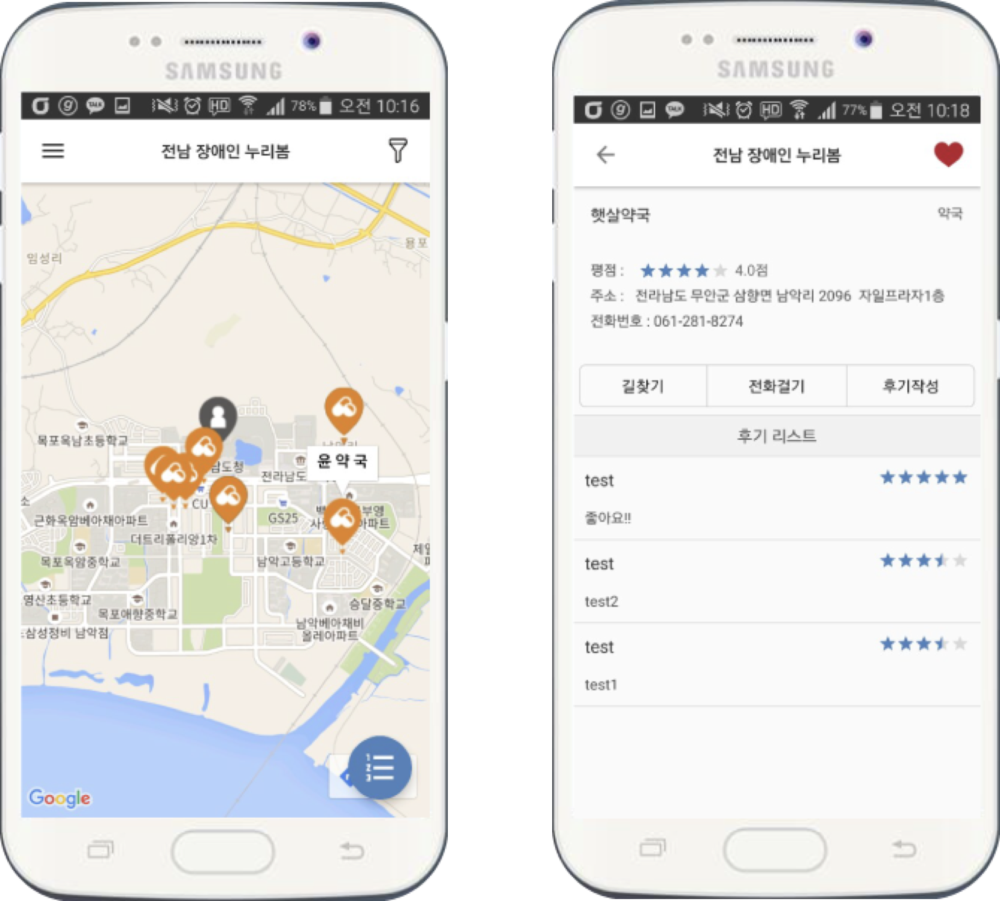

### 의료 기관 정보 제공 어플리케이션 개발 

- 2016 전남 모바일 앱 공모전 우수상 수상작, 2016.09 ~ 2016.11 

- Overview                           

  - 위치 및 공공데이터 기반 의료 기관 정보 제공 서비스 개발

  - 공공데이터 기반 약국, 의료 기관, 재활 센터 등의 의료 정보 제공 어플리케이션 개발

  - 시각장애인의 접근성을 고려하여 Android Talkback 서비스 활용 음성 가이드 기능 구현

- Contribution          

  - Android Client 개발                                                                      

  - 데이터 베이스 및 서버 개발

  - Application UI 		

  

- Used Skills                        
  \#Android #Google Map API #MySql #PHP 